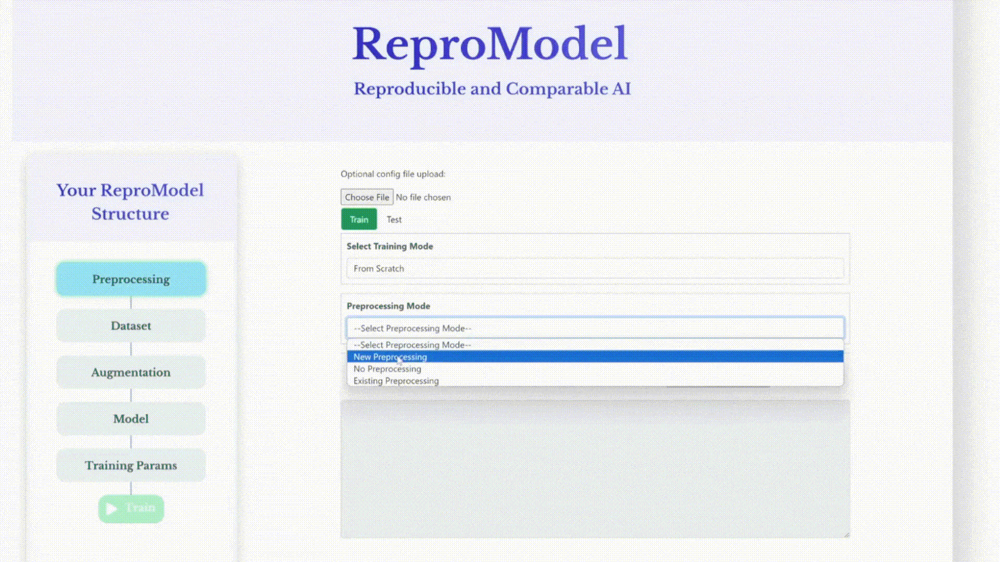

<p align = "center">
  
</p>

<h3 align = "center">ReproModel</h3>

<p align = "center">Model Comparison Tool for AI Researchers</p>

<div align = "center">
  <a href = "https://github.com/ReproModel/repromodel/stargazers"></a>
  <a href = "https://github.com/ReproModel/repromodel/blob/main/LICENSE"></a>
  
</div>

<br/>

**ReproModel**  helps the AI research community to <strong>reproduce and compare AI models</strong> faster.

ReproModel toolbox revolutionizes research efficiency by providing standardized models, dataloaders, and processing procedures. It features a comprehensive suite of pre-existing experiments, a code extractor, and an LLM descriptor. This toolbox <strong>allows researchers to focus on new datasets and model development</strong>, significantly reducing time and computational costs.

With this <strong>no-code solution</strong>, you'll have access to a collection of benchmark and SOTA models and datasets. Dive into training visualizations, effortlessly extract code for publication, and let our LLM-powered automated methodology description writer do the heavy lifting.

The current prototype helps researchers to modularize their development and compare the performance of <strong>each step in the pipeline in a reproducible way</strong>. This prototype version helped us reduce the time for model development, computation, and writing by at least 40%. Watch our [demo](https://www.youtube.com/watch?v=MQHZMEloUps).

The coming versions will help researchers build upon state-of-the-art research faster by just <strong>loading the previously published study ID</strong>. All code, experiments, and results will already be verified and stored in our system.

https://repromodel.netlify.app

## Features
:white_check_mark: Standard Models Included<br/>
:white_check_mark: Known Datasets<br/>
:white_check_mark: Metrics (100+)<br/>
:white_check_mark: Losses (20+)<br/>
:white_check_mark: Data Splitting<br/>
:white_check_mark: Augmentations<br/>
:white_check_mark: Optimizers (10+)<br/>
:white_check_mark: Learning Rate Schedulers<br/>
:white_check_mark: Early Stopping Criterion<br/>
:white_check_mark: Training Device Selection<br/>
:white_check_mark: Logging (Tensorboard ...)<br/>
:black_square_button: AI Experiment Description Generator<br/>
:black_square_button: Code Extractor<br/>
:black_square_button: Custom Script Editor<br/>

## Documentation
For examples and step-by-step instructions, please visit our full documentation at https://www.repromodel.com/docs. (COMING SOON)

## Running Locally
You will need to have [Node.js](https://nodejs.org) installed.<br/> 

**Combines npm install, creation of a virtual environment, as well as the launch of the frontend and backend:**
```
npm run repromodel
```

**Launch the frontend instead individually:**
```
npm install
npm run dev
```

## Contributing
Contributions are what make the open-source community such an amazing place to learn, inspire, and create.

Any contributions you make are greatly appreciated. If you have a suggestion that would make this better, please read our [Contribution Guidelines](Contributing.md) and [Code of Conduct](CODE_OF_CONDUCT.md).

<table>
  <tr>
    <td align = "center">
      <br/>
      <sub><b>Dario Sitnik, PhD</b></sub><br/>
      <sub>AI Scientist</sub><br/>
      <a href="https://github.com/dsitnik">GitHub</a>
    </td>
    <td align = "center">
      <br/>
      <sub><b>Mint Owl</b></sub><br/>
      <sub>ML Engineer</sub><br/>
      <a href="https://github.com/mintowltech">GitHub</a>
    </td>
    <td align = "center">
      <br/>
      <sub><b>Martin Schumakher</b></sub><br/>
      <sub>Developer</sub><br/>
      <a href = "https://github.com/martinschum">GitHub</a>
    </td>
    <td align = "center">
      <br/>
      <sub><b>Tomonari Feehan</b></sub><br/>
      <sub>Developer</sub><br/>
      <a href = "https://github.com/tomonarifeehan">GitHub</a>
    </td>
  </tr>
</table>

## Stats


## Questions & Support
For questions or any type of support, you can reach out to me via dario.sitnik@gmail.com

## License
This project is licensed under the [MIT License](LICENSE).

<br/>


